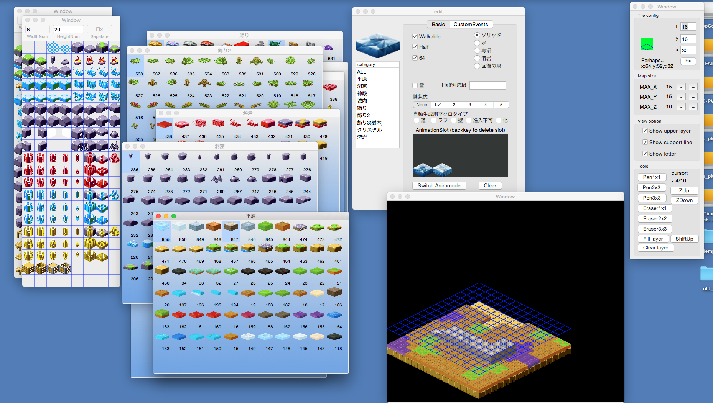

# qMapEditor

qMapEditorは、クオータービュー用マップエディタです。

Mac OS Xで動作します。

以下の機能があります。

・マップパネル画像から、マップパネルを生成
・水・毒沼・溶岩・回復の泉対応
・マップパネルのアニメーション対応
・3次元のマップを編集
・保存・ロード

## 関連ツール

- 出力されたメタデータは、qEnemyGeneratorに入力することによってさらに、敵情報を自動生成し、ステージ敵情報もセットで生成することができます。
- qMapBuilderで生成したメタデータを読みこめば、途中から編集することが可能です。

## 出力形式

- pdat (パネル情報のセーブデータ)
- mdat (マップ情報のセーブデータ)
- map（ゲームに用いるテキスト化されたマップデータ。qEnemyGenerator互換）

## スクリーンショット

画面の左から、タイルウィンドウ、パネルパレット、パネルエディタ、マップエディタ、ツールウィンドウです。

